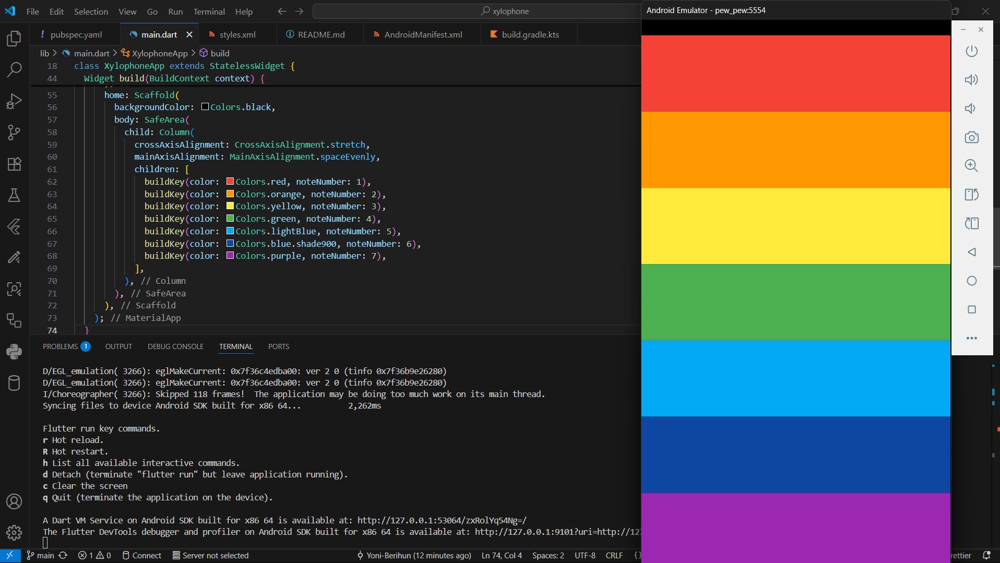

<!-- Cover Image -->
<p align="center">
  
</p>

<h1 align="center">🎵 Flutter Xylophone App</h1>
<p align="center">
  <i>Unleash your inner musician — tap the keys and create melodies 🎹</i>
</p>

<p align="center">
  <a href="https://flutter.dev/"></a>
  <a href="https://dart.dev/"></a>
  <a href="https://pub.dev/packages/audioplayers"></a>
</p>

---

## 📌 Overview

**Xylophone App** is a simple, fun, and interactive musical instrument built with **Flutter**.  
Each colored bar plays a different musical note when tapped, making it the perfect app to learn **Flutter basics**, **UI design**, and **sound playback**.

🎯 **Goal:** Understand Flutter widgets, sound assets, and async programming — all while having fun!  

---

## ✨ Features

- 🎵 **Play Notes Instantly** — Tap any key to hear a clear xylophone sound.
- 🎨 **Beautiful Colorful Keys** — Designed with a minimal, eye-catching UI.
- ⚡ **Fast & Lightweight** — Smooth animations and zero performance lag.
- 📱 **Cross-Platform** — Runs seamlessly on both **Android** and **iOS**.
- 🔊 **Audio Playback** — Integrated with the latest **audioplayers** package.

---

## 🖼️ Screenshots


  

</p>

---

## 🛠️ Tech Stack

- **Framework:** [Flutter](https://flutter.dev)
- **Language:** [Dart](https://dart.dev)
- **Audio Library:** [Audioplayers](https://pub.dev/packages/audioplayers)
- **UI Components:** Material Design

---

## 🚀 Installation & Setup

Follow these simple steps to run the project locally:

```bash
# Clone the repository
git clone https://github.com/yoni-berihun/flutter-xylophone.git

# Navigate into the project folder
cd flutter-xylophone

# Get the dependencies
flutter pub get

# Run the app
flutter run
````


## 🧠 Concepts Covered

This project helps you understand:

* **Flutter Widgets** → `MaterialApp`, `SafeArea`, `Column`, `Expanded`, and more.
* **Async & Await** → Used for playing sound files.
* **Asset Management** → Organizing `.wav` files in the project.
* **Custom UI Styling** → Colors, shapes, and spacing.
* **Status Bar Styling** → Handling dark/light icons with `SystemChrome`.

---

## 📂 Project Structure

```
flutter-xylophone/
│
├── assets/
│   ├── note1.wav
│   ├── note2.wav
│   └── ... note7.wav
│
├── lib/
│   └── main.dart
│
├── android/
├── ios/
└── pubspec.yaml
```

---

## 🐛 Troubleshooting

If you face errors like **"resource style not found"**:

* Update your **`compileSdkVersion`** to at least **33**.
* Ensure `styles.xml` has a proper theme.
* Run:

  ```bash
  flutter clean
  flutter pub get
  flutter run
  ```

---

## 📬 Connect With Me

<p align="center">
  <a href="https://github.com/yoni-berihun"></a>
  <a href="mailto:yoniberihun@gmail.com"></a>
</p>

---


<p align="center">
  <b>Made with ❤️ by <a href="https://github.com/yoni-berihun"> @yoni-berihun </a></b>
</p>


